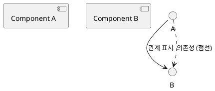
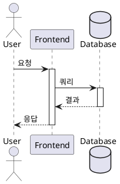
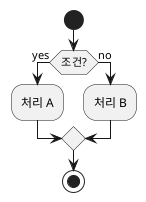
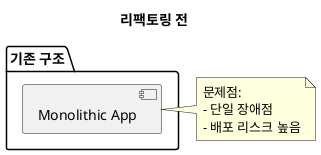

# PlantUML 다이어그램 템플릿 가이드

실무에서 바로 활용 가능한 다양한 PlantUML 다이어그램 템플릿 모음입니다.

## 📁 디렉토리 구조

```
docs/diagrams/
├── components/              # 컴포넌트 구조 다이어그램
│   ├── 01-hierarchical-component.puml
│   ├── 02-module-federation.puml
│   └── 03-microservices-backend.puml
├── data-flow/              # 데이터 흐름 다이어그램
│   ├── 01-sequence-api-flow.puml
│   ├── 02-activity-order-process.puml
│   └── 03-react-data-flow.puml
├── state-management/       # 상태 관리 다이어그램
│   ├── 01-state-machine.puml
│   └── 02-timing-diagram.puml
├── type-system/            # 타입 시스템 다이어그램
│   ├── 01-class-diagram-typescript.puml
│   └── 02-generic-type-relationships.puml
├── architecture/           # 아키텍처 다이어그램
│   ├── 01-c4-level1-context.puml
│   ├── 01-c4-level2-container.puml
│   ├── 01-c4-level3-component.puml
│   ├── 02-deployment-diagram.puml
│   └── 03-network-security.puml
└── README.md              # 이 파일
```

## 🚀 빠른 시작

### 1. PlantUML 설치

#### VSCode 사용자
```bash
# VSCode 확장 설치
code --install-extension jebbs.plantuml
```

**추천 확장**:
- PlantUML (jebbs.plantuml)
- Markdown Preview Enhanced (shd101wyy.markdown-preview-enhanced)

#### CLI 도구 설치 (선택)
```bash
# Node.js 프로젝트인 경우
pnpm add -D @plantuml/cli

# 또는 Java 기반 (Homebrew)
brew install plantuml
```

### 2. 다이어그램 생성

#### 방법 1: VSCode에서 실시간 프리뷰
1. `.puml` 파일 열기
2. `Cmd+Shift+P` → "PlantUML: Preview Current Diagram"
3. 실시간으로 편집 결과 확인

#### 방법 2: CLI로 이미지 생성
```bash
# SVG 생성 (추천)
plantuml -tsvg docs/diagrams/**/*.puml

# PNG 생성
plantuml -tpng docs/diagrams/**/*.puml

# 특정 파일만
plantuml -tsvg docs/diagrams/components/01-hierarchical-component.puml
```

#### 방법 3: npm 스크립트 사용
```json
// package.json
{
  "scripts": {
    "diagram": "plantuml -tsvg docs/diagrams/**/*.puml",
    "diagram:watch": "plantuml -tsvg -progress docs/diagrams/**/*.puml -watch"
  }
}
```

```bash
pnpm diagram         # 한 번 생성
pnpm diagram:watch   # 파일 변경 감지 후 자동 생성
```

## 📚 템플릿 카탈로그

### 1. 컴포넌트 다이어그램 (Components)

#### 01-hierarchical-component.puml
**용도**: 프론트엔드 컴포넌트 계층 구조

**활용 사례**:
- React/Vue 컴포넌트 트리 시각화
- Container/Presenter 패턴 설명
- 컴포넌트 리팩토링 전후 비교

**주요 특징**:
- Page → Container → Presentational → Atomic 계층 표현
- Props 전달 경로 표시
- 색상별 레이어 구분

**커스터마이징 포인트**:
```plantuml
' 자신의 컴포넌트로 변경
[YourPage] <<page>>
[YourContainer] <<container>>
YourPage --> YourContainer
```

#### 02-module-federation.puml
**용도**: 마이크로 프론트엔드 / Webpack Module Federation

**활용 사례**:
- 독립 배포 가능한 모듈 설계
- Host/Remote 관계 시각화
- 공유 라이브러리 의존성 관리

**주요 특징**:
- Host App (Shell) 구조
- Remote Module exposes 설정
- Shared Dependencies (React, Router 등)

#### 03-microservices-backend.puml
**용도**: 백엔드 마이크로서비스 아키텍처

**활용 사례**:
- 도메인별 서비스 분리 (DDD)
- API Gateway 패턴
- 동기/비동기 통신 표현

**주요 특징**:
- User, Order, Payment, Notification 도메인 예시
- REST API (동기) vs Message Queue (비동기)
- Database per Service 패턴
- Circuit Breaker, Retry 정책 주석

### 2. 데이터 흐름 다이어그램 (Data Flow)

#### 01-sequence-api-flow.puml
**용도**: API 요청-응답 시퀀스

**활용 사례**:
- 클라이언트-서버 통신 흐름
- 인증/인가 과정 설명
- 캐싱, 재시도 로직 표현

**주요 특징**:
- 인증 → 인가된 API 요청 → 에러 처리 전 과정
- Redis 캐싱 전략 (Hit/Miss)
- Token 재발급 (refreshToken) 시퀀스
- Exponential Backoff 재시도

**커스터마이징 예시**:
```plantuml
' 자신의 API 엔드포인트로 변경
frontend -> gateway : POST /your/api/endpoint
gateway -> yourService : 처리 요청
```

#### 02-activity-order-process.puml
**용도**: 복잡한 비즈니스 프로세스 (Activity Diagram)

**활용 사례**:
- 주문 처리 전체 플로우
- Saga 패턴 설계
- 보상 트랜잭션 (Compensating Transaction)

**주요 특징**:
- 조건 분기 (if/else)
- 병렬 처리 (fork/join)
- 서비스별 Partition
- 보상 트랜잭션 (재고 복구, 환불)

#### 03-react-data-flow.puml
**용도**: React 컴포넌트 데이터 흐름

**활용 사례**:
- Props Down, Events Up 패턴
- Zustand/Redux 상태 관리 흐름
- Optimistic UI 구현

**주요 특징**:
- useEffect → API 호출 → 상태 업데이트
- Optimistic Update (즉시 UI 반영 → API 호출)
- Rollback 로직 (API 실패 시)
- Context API vs Zustand 비교

### 3. 상태 관리 다이어그램 (State Management)

#### 01-state-machine.puml
**용도**: 상태 머신 (State Machine / FSM)

**활용 사례**:
- 엔티티 상태 전이 (Order, Payment, Shipment)
- XState 라이브러리 설계
- 상태별 허용 액션 정의

**주요 특징**:
- CREATED → PENDING_PAYMENT → PAID → ... → CONFIRMED
- 취소/환불 플로우
- 각 상태별 허용 액션, 제약 조건
- Timeout 정책 (5분 후 자동 취소 등)
- 보상 트랜잭션 표시

**커스터마이징**:
```plantuml
' 자신의 상태 머신으로 변경
state YOUR_STATE {
  YOUR_STATE : 설명
  YOUR_STATE : 허용 액션
}
YOUR_STATE --> NEXT_STATE : 전이 조건
```

#### 02-timing-diagram.puml
**용도**: 타이밍 다이어그램 (실시간 통신)

**활용 사례**:
- WebSocket 실시간 협업 시스템
- 동시성 제어 (Operational Transform, CRDT)
- 성능 병목 구간 분석

**주요 특징**:
- 시간 축 기반 표현 (@0ms, @100ms, ...)
- User A, User B 동시 편집 충돌 해결
- OT (Operational Transform) 알고리즘
- 재접속 시 동기화 과정

### 4. 타입 시스템 다이어그램 (Type System)

#### 01-class-diagram-typescript.puml
**용도**: TypeScript/OOP 클래스 다이어그램

**활용 사례**:
- DDD 엔티티/밸류 객체 모델링
- 인터페이스/추상 클래스 관계
- Repository 패턴 설계

**주요 특징**:
- IEntity, IAggregateRoot 인터페이스
- BaseEntity, AggregateRoot 추상 클래스
- User, Order 도메인 엔티티
- Email, Money, Address 밸류 객체
- UserService, OrderService 도메인 서비스

**관계 표현**:
- `<|..` : 인터페이스 구현
- `<|--` : 상속
- `*--` : 컴포지션 (강한 소유)
- `o--` : 집합
- `..>` : 의존성

#### 02-generic-type-relationships.puml
**용도**: TypeScript 제네릭 타입 시스템

**활용 사례**:
- 복잡한 제네릭 타입 설명
- Utility Types (Partial, Pick, Omit 등)
- Conditional Types, Mapped Types

**주요 특징**:
- `SearchConfig<T>`, `SearchField<T, K>` 제네릭 구조
- `Partial<T>`, `Required<T>`, `Pick<T, K>` 내장 타입
- `FieldValue<T, K>` Conditional Type 예시
- 타입 추론 흐름 차트

**활용 예시**:
```plantuml
' 자신의 제네릭 타입으로 변경
class "YourConfig<T>" <<generic>> {
  {field} data: T
  {method} + getData(): T
}
```

### 5. 아키텍처 다이어그램 (Architecture)

#### 01-c4-level1-context.puml, 01-c4-level2-container.puml, 01-c4-level3-component.puml
**용도**: C4 Model (3개 레벨로 분리)

**Level 1: System Context** (`01-c4-level1-context.puml`)
- **대상**: 경영진, 비기술 이해관계자
- **내용**: 시스템 경계, 외부 시스템 연동 (SendGrid, Stripe, S3)
- **활용**: 비즈니스 요구사항 정의, 시스템 범위 합의

**Level 2: Container** (`01-c4-level2-container.puml`)
- **대상**: 아키텍트, 테크 리드
- **내용**: React SPA, Node.js API, PostgreSQL, Redis, Kafka
- **활용**: 기술 스택 선택, 통신 프로토콜 정의, 배포 단위 식별

**Level 3: Component** (`01-c4-level3-component.puml`)
- **대상**: 개발자
- **내용**: User Service 내부 (Middleware, Controller, Service, Repository)
- **활용**: Layered Architecture 구현, 의존성 관리

**Zoom In/Out 전략**:
- 각 레벨이 독립 파일로 분리되어 필요한 레벨만 사용 가능
- VSCode에서 개별 프리뷰 가능

#### 02-deployment-diagram.puml
**용도**: Kubernetes 배포 아키텍처

**활용 사례**:
- AWS EKS 클러스터 설계
- VPC, Subnet, Security Group
- Pod, Service, StatefulSet

**주요 특징**:
- Public Subnet (ALB, NAT)
- Private Subnet (EKS Pods)
- Database Subnet (RDS, DocumentDB)
- Namespace별 분리 (frontend, backend, data)
- Auto Scaling, Health Check 설정

**비용 예측 포함**:
- EKS: $75/월
- EC2 Nodes: $800/월
- RDS: $450/월
- 총 ~$1,450/월

#### 03-network-security.puml
**용도**: 네트워크 & 보안 아키텍처

**활용 사례**:
- Security Group 규칙 설계
- Zero Trust 아키텍처
- DDoS 방어, WAF 정책

**주요 특징**:
- Internet → DMZ → Application → Data 계층
- AWS Shield, WAF, CloudFront
- Service Mesh mTLS (Istio)
- Secrets Manager, CloudTrail
- 보안 사고 대응 절차 (Incident Response)

**컴플라이언스**:
- GDPR, PCI-DSS, SOC 2, ISO 27001 준수

## 🎨 스타일 가이드

### 색상 정책 (회색 톤만 사용)

```plantuml
' ✅ 권장: 회색 톤 사용
skinparam component {
  BackgroundColor<<interface>> #F0F0F0
  BackgroundColor<<service>> #E0E0E0
  BackgroundColor<<database>> #D0D0D0
}

' ❌ 금지: 컬러 사용 (사용자 설정에 따라 다름)
' BackgroundColor #FF0000  (빨강)
' BackgroundColor #00FF00  (초록)
```

**이유**: 흑백 인쇄, 색맹 사용자 고려, 통일성

### 주석 작성 원칙

모든 다이어그램에 다음 주석 포함:
1. **비즈니스 로직 설명**: 왜 이 구조를 선택했는지
2. **성능 고려사항**: 응답 시간, 처리량, 병목점
3. **확장성 고려**: 사용자 증가 시 대응 방안
4. **코드 예시**: 실제 구현 가능한 TypeScript/Python 코드

**예시**:
```plantuml
note right of UserService
  **Service Layer 패턴**

  ```typescript
  class UserService {
    async registerUser(dto: RegisterUserDto) {
      // 1. 이메일 중복 검사
      // 2. 비밀번호 해싱
      // 3. User Entity 생성
    }
  }
  ```

  **성능**: ~100ms (DB 쿼리 50ms + 해싱 50ms)
end note
```

## 🔧 자주 사용하는 PlantUML 문법

### 1. 기본 요소



### 2. 스타일 적용

```plantuml
' 스테레오타입으로 스타일 그룹화
[User Service] <<service>>
[PostgreSQL] <<database>>

skinparam component {
  BackgroundColor<<service>> #E0E0E0
  BackgroundColor<<database>> #D0D0D0
}
```

### 3. 그룹핑

```plantuml
package "Backend Services" {
  [User Service]
  [Order Service]
}

node "Kubernetes Cluster" {
  [Pod 1]
  [Pod 2]
}
```

### 4. 화살표 종류

```plantuml
A --> B   : 일반 화살표
A ..> B   : 점선 화살표
A -[#red]-> B : 빨간색 화살표
A -[#blue,dashed]-> B : 파란 점선
```

### 5. 시퀀스 다이어그램



### 6. 조건 분기



## 📖 실무 활용 팁

### 1. 리팩토링 문서화

**AS-IS vs TO-BE 비교**



### 2. PR 리뷰용 다이어그램

Pull Request 설명에 다이어그램 포함:

```markdown
## 변경 사항


### 주요 개선점
- API Gateway 추가로 중앙 인증 처리
- Redis 캐싱으로 응답 시간 50% 단축
```

### 3. 온보딩 문서

신입 개발자를 위한 시스템 이해 자료:

```
docs/
├── onboarding/
│   ├── 01-system-overview.svg      (C4 Level 1)
│   ├── 02-tech-stack.svg          (C4 Level 2)
│   ├── 03-data-flow.svg           (시퀀스)
│   └── 04-deployment.svg          (배포)
```

### 4. 장애 보고서

Post-Mortem에 타이밍 다이어그램 사용:

```plantuml
@startuml
robust "Load Balancer" as LB
robust "Service A" as A
robust "Database" as DB

@0
LB is Running
A is Running
DB is Running

@100
DB is Down  ' 장애 발생
A is Error

@150
LB is Retry  ' 재시도 시작

@200
DB is Running  ' 복구
@enduml
```

## 🚨 문제 해결 (Troubleshooting)

### PlantUML 렌더링 안 됨

**증상**: VSCode에서 프리뷰가 보이지 않음

**해결책**:
```bash
# Java 설치 확인 (PlantUML은 Java 기반)
java -version

# Java 미설치 시
brew install openjdk@17

# VSCode 설정 확인
{
  "plantuml.server": "https://www.plantuml.com/plantuml",
  "plantuml.render": "PlantUMLServer"
}
```

### 다이어그램이 너무 큼

**증상**: 컴포넌트가 많아서 화면에 안 들어옴

**해결책**:
```plantuml
' 방법 1: 스케일 조정
scale 0.8

' 방법 2: 가로 레이아웃
left to right direction

' 방법 3: 분할
' C4 Model처럼 Level별로 파일 분리
```

### 한글 깨짐

**증상**: 한글이 □□□로 표시

**해결책**:
```plantuml
@startuml
skinparam defaultFontName "맑은 고딕"
' 또는
skinparam defaultFontName "Nanum Gothic"
@enduml
```

## 📚 추가 학습 자료

### 공식 문서
- [PlantUML 공식 가이드](https://plantuml.com/ko/)
- [PlantUML Cheat Sheet](https://ogom.github.io/draw_uml/plantuml/)

### C4 Model
- [C4 Model 공식 사이트](https://c4model.com/)
- [C4-PlantUML](https://github.com/plantuml-stdlib/C4-PlantUML)

### 실무 예시
- [AWS Architecture Icons for PlantUML](https://github.com/awslabs/aws-icons-for-plantuml)
- [Azure PlantUML](https://github.com/plantuml-stdlib/Azure-PlantUML)
- [Kubernetes PlantUML](https://github.com/dcasati/kubernetes-PlantUML)

## 💡 기여하기

새로운 템플릿 추가 또는 개선 사항이 있다면:

1. `docs/diagrams/examples/` 디렉토리에 예시 작성
2. 이 README에 설명 추가
3. Pull Request 생성

**템플릿 작성 규칙**:
- 파일명: `<순서>-<용도>-<타입>.puml` (예: `01-user-flow-sequence.puml`)
- 주석 필수 (용도, 활용 사례, 주요 특징)
- 색상은 회색 톤만 사용
- 실제 코드 예시 포함

## 📞 문의

- 프로젝트 Issue: [GitHub Issues](https://github.com/your-repo/issues)
- PlantUML 질문: [PlantUML Forum](https://forum.plantuml.net/)

---

**마지막 업데이트**: 2025-01-15
**작성자**: Technical Documentation Team
